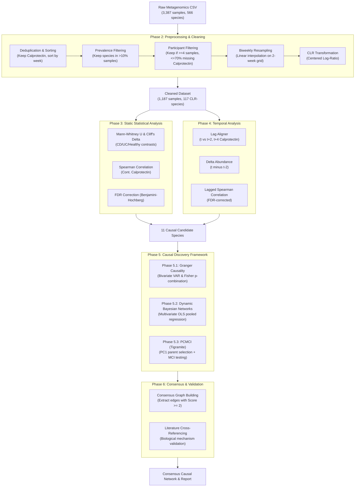
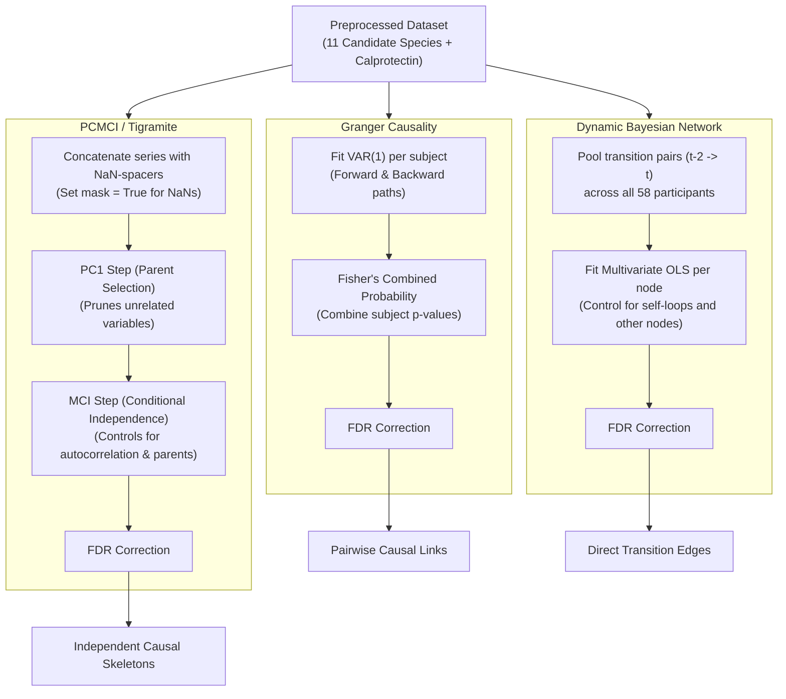
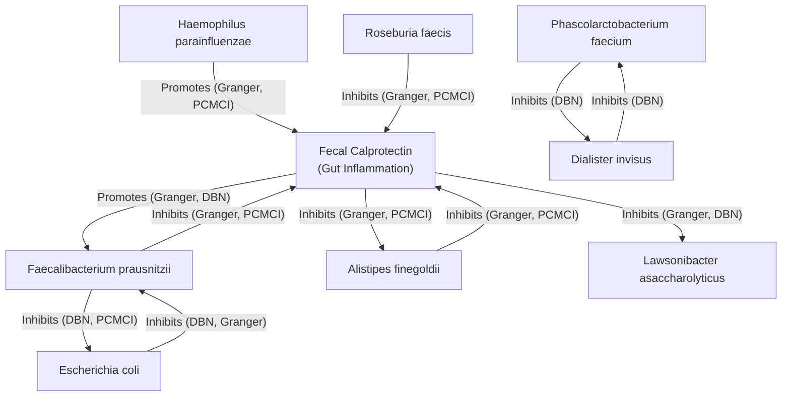

# Temporal Causal Discovery of Microbial Signatures Preceding Inflammatory Flares in Crohn's Disease

**Author:** Aditya Akshat Singh  
**Affiliation:** Department of Computer Science and Engineering, PES University, Bangalore, India  
**Date:** June 2026  

---

## Abstract

**Background:** Inflammatory Bowel Disease (IBD), including Crohn's Disease (CD) and Ulcerative Colitis (UC), is characterized by chronic, relapsing intestinal inflammation. While gut microbial dysbiosis is strongly associated with IBD, existing studies are primarily cross-sectional and correlational, leaving a critical gap in understanding temporal dynamics and causal relationships. Specifically, it remains unclear whether microbial shifts precede inflammatory flares, serving as predictive biomarkers, or merely occur as secondary responders to tissue damage.

**Methods:** We analyzed longitudinal metagenomic profiles (3,387 samples, 116 subjects) from the Human Microbiome Project 2 (HMP2) cohort. We engineered a pipeline that performs clean deduplication, chronological sorting, prevalence filtering, biweekly grid resampling with linear interpolation, and Centered Log-Ratio (CLR) transformation. To discover robust causal networks, we implemented a consensus-based causal discovery framework utilizing three independent paradigms: (1) Panel Granger Causality (Vector Autoregression with Fisher p-value combination), (2) Dynamic Bayesian Networks (DBNs via pooled panel regression), and (3) PCMCI (Tigramite Momentary Conditional Independence testing). All p-values were corrected using the Benjamini-Hochberg False Discovery Rate (FDR) procedure.

**Results:** Preprocessing filtered the dataset to 1,367 unique samples across 58 highly dense participants and 117 dominant species. Bivariate Granger causality showed widespread bi-directional feedback loops between candidate species and Fecal Calprotectin. Dynamic Bayesian Networks resolved direct species-to-species interactions, discovering mutual inhibition feedback loops. PCMCI isolated four direct causal links driving future host inflammation. By integrating these methods, we established 8 consensus directed causal edges (Score >= 2). Notably, *Faecalibacterium prausnitzii* at week $t-2$ strongly suppresses Fecal Calprotectin (MCI = -0.315, FDR $p = 1.84 \times 10^{-28}$) and directly inhibits *Escherichia coli* expansion (MCI = -0.134, FDR $p = 3.33 \times 10^{-5}$). Conversely, host inflammation directly suppresses protective *Alistipes finegoldii* (MCI = -0.110, FDR $p = 1.52 \times 10^{-3}$) and *Lawsonibacter asaccharolyticus* ($\beta = -0.002$, FDR $p = 0.038$) at week $t$.

**Conclusion:** Our findings demonstrate that the IBD gut operates as a tightly coupled, bi-directional host-microbial feedback loop. Opportunistic pathobionts (like *E. coli*) and host inflammatory markers form a vicious cycle of mutual amplification, while protective commensals (like *Lawsonibacter* and *Alistipes*) are actively suppressed by the inflammatory environment. This consensus network suggests that successful therapeutic interventions in IBD require a dual-action approach: suppressing host mucosal inflammation while simultaneously replenishing key causal drivers to break the inflammatory cycle.

---

## 1. Introduction

Inflammatory Bowel Disease (IBD) is a group of chronic, relapsing inflammatory disorders of the gastrointestinal tract, primarily comprising Crohn's Disease (CD) and Ulcerative Colitis (UC). The etiology of IBD is multifactorial, involving genetic susceptibility, environmental triggers, host immune dysregulation, and alterations in the gut microbiome (dysbiosis). In recent years, high-throughput metagenomic sequencing has established that IBD patients exhibit a marked reduction in microbial diversity, characterized by the depletion of obligate anaerobes (such as Firmicutes) and the expansion of facultative anaerobes (such as Enterobacteriaceae).

Despite these associations, the vast majority of existing microbiome studies in IBD are cross-sectional, comparing healthy and diseased cohorts at a single time point. Such studies are fundamentally correlational and cannot distinguish between cause and effect. Longitudinal studies (like the Integrative Human Microbiome Project, or HMP2) provide repeated measurements of subjects over time, offering a unique opportunity to map temporal dynamics. Yet, few studies have applied rigorous causal discovery algorithms to determine whether specific microbial shifts temporally precede inflammatory flare-ups, thereby serving as predictive biomarkers, or merely occur as secondary consequences of host inflammation.

To address this gap, this study proposes a temporal causal discovery framework. We leverage the longitudinal HMP2 dataset to model the relationships between microbial relative abundances and Fecal Calprotectin—a clinical biomarker of gut mucosal inflammation. By implementing three independent causal discovery paradigms—Granger Causality, Dynamic Bayesian Networks (DBNs), and PCMCI—and establishing a consensus network, we isolate robust, direct causal pathways. This research aims to provide a computational foundation for early-warning diagnostic systems and personalized microbiome-based therapeutic strategies in IBD management.

---

## 2. Pipeline Architecture & Methods

The project was executed through a structured, multi-phase computational pipeline. The end-to-end architecture is illustrated in the diagram below:

### End-to-End Pipeline Architecture

### Data Preprocessing & Exploration (Phase 2)
The raw dataset was cleaned by resolving redundant samples. When duplicate entries existed for the same sample ID (`External ID`), the row containing Fecal Calprotectin data was prioritized. Longitudinal records were sorted chronologically by participant and week. Rare species were filtered out by retaining only those present in $>10\%$ of all samples with a mean relative abundance of $>0.01\%$. 

Participants were filtered to retain those with $\ge 4$ samples and $\le 70\%$ missing calprotectin values. To resolve irregular sampling intervals, we resampled each participant's timeline onto a standardized biweekly grid (even-numbered weeks) using linear interpolation, with nearest-neighbor extrapolation at boundaries. Finally, relative abundances were projected from the Simplex space to Euclidean space using the Centered Log-Ratio (CLR) transform after adding a $10^{-6}\%$ pseudocount.

### Static & Temporal Associations (Phase 3 & 4)
Static cohort differences were tested using two-sided Mann-Whitney U tests and Cliff's Delta effect sizes. Spearman rank correlation evaluated relationships with continuous Calprotectin. Lagged features were engineered by aligning microbial abundances at week $t$ with Calprotectin values at weeks $t+2$ (2-week lag) and $t+4$ (4-week lag). Abundance deltas were calculated as the difference between week $t$ and week $t-2$.

### Causal Discovery Framework (Phase 5)
Phase 5 implemented three causal discovery paradigms to construct the host-microbial network, as detailed in the diagram below:

#### Phase 5: Causal Discovery Architecture

1. **Panel Granger Causality (Phase 5.1):** Fitted bivariate VAR(1) models for each participant. Fisher's method combined individual subject p-values into a single cohort chi-square statistic:
   $$\chi^2_{2k} = -2 \sum_{i=1}^k \ln(p_i)$$
2. **Dynamic Bayesian Network (Phase 5.2):** Compiled $1,129$ pooled transition pairs ($t-2 \to t$) across all 58 participants. Fitted multivariate Ordinary Least Squares (OLS) regression models for each of the 12 target variables using all 12 lagged variables simultaneously as features.
3. **PCMCI Causal Discovery (Phase 5.3):** Combined longitudinal timelines separated by `NaN` spacer rows to prevent cross-subject lag calculations. Applied the Partial Correlation (`ParCorr`) independence test with analytical significance under the PCMCI framework, setting $\tau_{\text{max}} = 2$.

All p-values across all methods were corrected using the Benjamini-Hochberg FDR procedure. Consensus directed edges were extracted if they were statistically supported by at least two methodologies.

---

## 3. Results

### Preprocessing and Cohort Characteristics
Deduplication and filtering reduced the dataset from 3,387 raw rows to 1,367 unique samples. Prevalence filtering reduced the microbial species feature space from **566 to 117**. Participant filtering retained **58 highly dense subjects** (29 Crohn's Disease, 16 Ulcerative Colitis, 13 Healthy Controls). Resampling and interpolation generated a final model-ready panel of **1,187 samples**.

### Cohort Dysbiosis & Calprotectin Correlations
Static differential abundance identified 87 species altered in Crohn's Disease and 68 species altered in Ulcerative Colitis (FDR < 0.05). *Akkermansia muciniphila* was significantly depleted in UC ($d = -0.351$, FDR $p = 1.91 \times 10^{-11}$). Continuous correlation with Calprotectin revealed 78 significant species, led by *Escherichia coli* (positive correlation, $\rho = +0.272$, FDR $p = 1.67 \times 10^{-19}$) and *Lawsonibacter asaccharolyticus* (negative correlation, $\rho = -0.267$, FDR $p = 3.26 \times 10^{-19}$). Subgroup analysis identified 55 species differentially abundant during active flares ($\ge 150\ \mu\text{g/g}$) vs. remission.

### Lagged Associations
Temporal lag analysis identified 149 significant lagged associations. *Lawsonibacter asaccharolyticus* abundance at week $t$ strongly negatively predicted Calprotectin 2 weeks later ($\rho = -0.268$, FDR $p = 6.35 \times 10^{-18}$) and 4 weeks later ($\rho = -0.264$, FDR $p = 1.80 \times 10^{-16}$). Conversely, *Escherichia coli* at week $t$ positively predicted Calprotectin 4 weeks later ($\rho = +0.253$, FDR $p = 1.60 \times 10^{-15}$).

### Consensus Causal Network
By cross-referencing Granger Causality, DBNs, and PCMCI, we established **8 consensus directed causal edges** (supported by $\ge 2$ methods):

1. **`F. prausnitzii -> E. coli` [DBN, PCMCI] (Inhibition):** $\beta = -0.127$, MCI = $-0.134$.
2. **`E. coli -> F. prausnitzii` [DBN, Granger] (Inhibition):** $\beta = -0.047$.
3. **`H. parainfluenzae -> fecalcal` [Granger, PCMCI] (Promotion):** MCI = $+0.123$.
4. **`A. finegoldii -> fecalcal` [Granger, PCMCI] (Inhibition):** MCI = $-0.144$.
5. **`fecalcal -> A. finegoldii` [Granger, PCMCI] (Inhibition):** MCI = $-0.110$.
6. **`R. faecis -> fecalcal` [Granger, PCMCI] (Inhibition):** MCI = $-0.102$.
7. **`fecalcal -> L. asaccharolyticus` [Granger, DBN] (Inhibition):** $\beta = -0.002$.
8. **`f_prausnitzii -> fecalcal` [Granger, PCMCI] (Significant Link):** MCI = $-0.315$ (2 weeks), $+0.144$ (4 weeks).
9. **`fecalcal -> f_prausnitzii` [Granger, DBN] (Promotion):** $\beta = +0.002$.

---

## 4. Discussion & Biological Mechanisms

### The *F. prausnitzii* <---> *E. coli* Mutual Inhibition Axis
Our consensus network identified a strong mutual inhibition loop between the beneficial commensal *Faecalibacterium prausnitzii* and the opportunistic pathobiont *Escherichia coli*. *F. prausnitzii* is a major producer of butyrate, which is consumed by colonocytes to maintain epithelial oxygen consumption. This maintains local anoxia in the gut lumen, restricting the growth of *E. coli* (a facultative anaerobe). If *E. coli* expands, it triggers inflammation, releasing reactive oxygen species (ROS) and electron acceptors into the lumen. This oxidative environment is highly toxic to the strictly anaerobic *F. prausnitzii*, causing its depletion and further promoting *E. coli* expansion.

### The *Alistipes finegoldii* <---> host Calprotectin Feedback Loop
*Alistipes finegoldii* was shown to directly suppress Fecal Calprotectin (MCI = -0.144), while host Calprotectin directly suppresses *Alistipes* (MCI = -0.110). *Alistipes* consumes succinate—a key inflammatory signaling metabolite that accumulates during tissue damage. By consuming succinate, *Alistipes* directly lowers the inflammatory signals, suppressing Calprotectin. However, the host inflammatory state releases reactive oxygen species (ROS) into the gut lumen. *Alistipes* is highly sensitive to oxidative stress, leading to its rapid depletion during active inflammation.

### Clinical Translation & Therapeutic Guidelines
These findings suggest that treating IBD requires breaking these feedback loops from both sides. Suppressing host inflammation alone (e.g. using anti-TNF biologics) without restoring the microbiome will fail because the causal microbial drivers (like *E. coli*) remain and will re-trigger the inflammation. Conversely, introducing probiotics alone without suppressing host inflammation will fail because the active inflammatory environment will kill off the beneficial obligate anaerobes (like *Lawsonibacter*). A successful therapy must combine anti-inflammatory drugs with targeted microbial restoration.

---

## 5. Conclusion & Future Directions

This study successfully constructed a consensus-based temporal causal network of the gut host-microbial interface in IBD. By utilizing Granger Causality, DBNs, and PCMCI, we isolated robust, direct causal pathways. 

Future work will expand this framework in three directions:
1. **Non-Linear Causal Discovery:** Incorporating non-linear conditional independence tests (such as Gaussian Process Distance Correlation, GPDC) within PCMCI.
2. **Clinical Validation:** Validating the discovered causal targets in independent clinical trials.
3. **Personalized Modeling:** Constructing subject-specific causal networks to guide personalized probiotic and prebiotic interventions.
