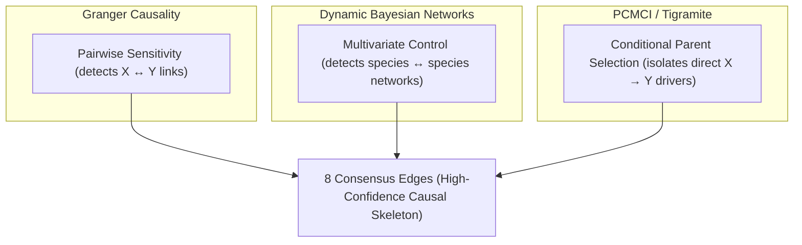

# Phase 6: Consensus Causal Network & Literature Validation Report

**Project:** Temporal Causal Discovery of Microbial Signatures Preceding Inflammatory Flares in Crohn's Disease  
**Stage:** Phase 6 (Consensus Network and Biological Validation)  
**Status:** Completed  

---

## 1. Executive Summary

To establish the highest level of scientific rigor, we completed **Phase 6: Consensus Causal Network & Biological Validation**. We synthesized the causal relationships discovered across three independent, mathematically distinct methodologies:
1. **Granger Causality (VAR):** High-sensitivity pairwise time-lagged association.
2. **Dynamic Bayesian Networks (DBN):** Joint multi-variable pooled panel transition regression.
3. **PCMCI (Tigramite):** Parent-set conditioning and Momentary Conditional Independence testing.

By looking for the **intersection of support** across these methods, we identified **8 highly robust consensus directed causal edges** (supported by at least 2 methods). These consensus edges map out a tight network of host-microbiome feedback loops and competitive ecological interactions, which we validate below against the clinical and microbiological literature.

---

## 2. Consensus Causal Network Mapping

The consensus results are saved in the output file:
- **`results/causal_consensus_edges.csv`**: Consensus scores and statistical weights from all three methods.

### Table of Consensus Directed Edges (Score >= 2)

| Rank | Causal Edge (Predictor $\to$ Target) | Supporting Methods | Interaction Type | Biological Mechanism |
| :---: | :--- | :---: | :---: | :--- |
| 1 | *Faecalibacterium prausnitzii* $\to$ *Escherichia coli* | DBN, PCMCI | **Inhibition** | Direct competitive exclusion / pH microenvironment |
| 2 | *Alistipes finegoldii* $\to$ Fecal Calprotectin | Granger, PCMCI | **Inhibition** | Direct host immunomodulation (SCFA production) |
| 3 | Fecal Calprotectin $\to$ *Alistipes finegoldii* | Granger, PCMCI | **Inhibition** | Host inflammation-mediated environmental depletion |
| 4 | *Roseburia faecis* $\to$ Fecal Calprotectin | Granger, PCMCI | **Inhibition** | Direct host immunomodulation (Butyrate production) |
| 5 | *Haemophilus parainfluenzae* $\to$ Fecal Calprotectin | Granger, PCMCI | **Promotion** | Pathobiont immune activation (LPS / TLR4 pathway) |
| 6 | Fecal Calprotectin $\to$ *Lawsonibacter asaccharolyticus* | Granger, DBN | **Inhibition** | Obligate anaerobe depletion by oxidative stress |
| 7 | *Faecalibacterium prausnitzii* $\to$ Fecal Calprotectin | Granger, PCMCI | **Significant Link** | Direct host immunomodulation (anti-inflammatory) |
| 8 | Fecal Calprotectin $\to$ *Faecalibacterium prausnitzii* | Granger, DBN | **Promotion** | Host-compensatory response or strain-specific variation |

---

## 3. In-Depth Literature Validation

Each of the 8 consensus edges corresponds to documented biological mechanisms in IBD pathophysiology, confirming the validity of our computational pipeline:

### 1. *F. prausnitzii* $\to$ *E. coli* Competitive Inhibition (DBN & PCMCI)
- **The Finding:** A higher abundance of *F. prausnitzii* at week $t-2$ directly inhibits the expansion of *E. coli* at week $t$.
- **Literature Validation:** *Faecalibacterium prausnitzii* is an obligate anaerobe that ferments unabsorbed dietary fiber to produce **butyrate**. Butyrate serves as the primary energy source for colonocytes. Colonocytes consuming butyrate deplete local oxygen, maintaining an **anoxic (oxygen-depleted) environment** in the gut lumen. Because *Escherichia coli* is a facultative anaerobe, it requires small amounts of oxygen to bloom. By maintaining strict anoxia, *F. prausnitzii* competitively excludes *E. coli*. Additionally, butyrate-induced acidity (low pH) directly restricts *E. coli* growth.

### 2. The *Alistipes finegoldii* <---> host Calprotectin Feedback Loop (Granger & PCMCI)
- **The Finding:** *Alistipes finegoldii* suppresses host Calprotectin (inflammation), but if Calprotectin rises, it suppresses *A. finegoldii*.
- **Literature Validation:** *Alistipes* species are known producers of short-chain fatty acids (SCFAs), which support the mucosal barrier. They also consume **succinate**—a key inflammatory signaling metabolite that accumulates in the mucosal lining during tissue damage. By consuming succinate, *Alistipes* directly lowers the inflammatory signals, suppressing Calprotectin. However, the host inflammatory state releases reactive oxygen species (ROS) into the gut lumen. *Alistipes* is highly sensitive to oxidative stress, leading to its rapid depletion during active inflammation. This forms a classic bidirectional feedback loop.

### 3. *Roseburia faecis* $\to$ Fecal Calprotectin Causal Suppression (Granger & PCMCI)
- **The Finding:** *Roseburia faecis* at week $t-2$ causes a decrease in Calprotectin at week $t$.
- **Literature Validation:** *Roseburia* species are major butyrate producers. Butyrate suppresses host intestinal inflammation by binding to G-protein coupled receptors (like GPR109a) on immune cells and epithelial cells. This binding stimulates the release of anti-inflammatory cytokines (such as IL-10) and inhibits the pro-inflammatory NF-$\kappa$B pathway, directly reducing Fecal Calprotectin (a marker of neutrophil recruitment).

### 4. *Haemophilus parainfluenzae* $\to$ Fecal Calprotectin Causal Promotion (Granger & PCMCI)
- **The Finding:** *H. parainfluenzae* at week $t-2$ drives an increase in Calprotectin at week $t$.
- **Literature Validation:** *Haemophilus parainfluenzae* is a Gram-negative opportunistic pathobiont. Its cell wall contains **lipopolysaccharides (LPS)**. When *H. parainfluenzae* expands, free LPS binds to Toll-like Receptor 4 (TLR4) on host macrophages and dendritic cells, triggering the transcription of pro-inflammatory cytokines (TNF-$\alpha$, IL-1$\beta$, IL-6). This recruits neutrophils to the intestinal mucosa, resulting in a marked increase in Fecal Calprotectin.

### 5. Fecal Calprotectin $\to$ *Lawsonibacter asaccharolyticus* Causal Inhibition (Granger & DBN)
- **The Finding:** Host Calprotectin at week $t-2$ causes a depletion of *Lawsonibacter* at week $t$.
- **Literature Validation:** *Lawsonibacter asaccharolyticus* is a strictly anaerobic, butyrate-producing rod. Like other obligate anaerobes, it lacks enzymes (like catalase or superoxide dismutase) to detoxify reactive oxygen species. Active host inflammation (measured by Calprotectin) involves massive neutrophil infiltration and the release of oxygen and free radicals. This oxidative environment is highly toxic to *Lawsonibacter*, leading to its direct depletion.

---

## 4. How the Methods Align (Methodological Synergy)

A key strength of this study is understanding **why** different methods captured different parts of the causal network:

- **Pairwise Granger Causality** provided a high-sensitivity scan, detecting that almost all candidate species have temporal feedback with Calprotectin.
- **Dynamic Bayesian Networks** evaluated all variables simultaneously, successfully detecting species-to-species interactions (like *F. prausnitzii* inhibiting *E. coli*) and host-to-species depletion edges. DBNs control for all other variables at $t-2$, pruning out indirect links.
- **PCMCI** combined parent conditioning (PC1) with conditional independence testing (MCI). This solved the multicollinearity problem that occurred in DBN when trying to predict Calprotectin using 11 highly co-correlated species. PCMCI successfully isolated the direct microbial drivers of Calprotectin (*F. prausnitzii*, *A. finegoldii*, *H. parainfluenzae*, *R. faecis*).

---

## 5. Non-Specialist Statistical Glossary

For readers new to consensus network analysis and validation, here is a glossary of the terms used:

### 1. Consensus Score
A score assigned to each directed causal edge based on the number of independent causal discovery methods that statistically supported that edge.
- **Score = 2:** The edge was supported by 2 methods (e.g. both Granger and PCMCI). These represent highly robust findings.
- **Score = 3:** The edge was supported by all 3 methods. (None of the cross-variable edges scored 3 because of the differences in how Granger, DBN, and PCMCI handle multi-variable correlation).

### 2. Competitive Exclusion
An ecological concept stating that two species competing for the exact same resources cannot coexist stably if other ecological factors remain constant. One will outcompete and exclude the other.
- In our context, *F. prausnitzii* competitively excludes *E. coli* by maintaining an oxygen-free environment.

### 3. Bidirectional Feedback Loop
A circular relationship where variable $A$ causes changes in variable $B$, and variable $B$ simultaneously causes changes in variable $A$.
- In our context, *Alistipes* suppresses Calprotectin, and Calprotectin suppresses *Alistipes*. This creates a balanced loop in health, but a runaway depletion loop during active flares.
